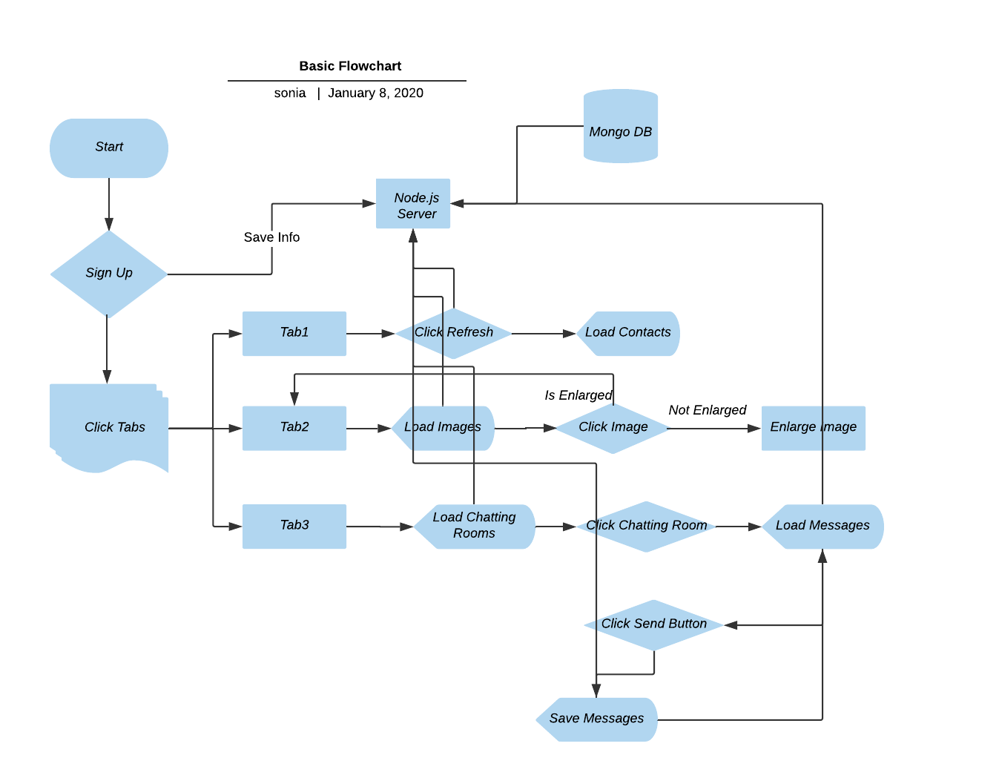
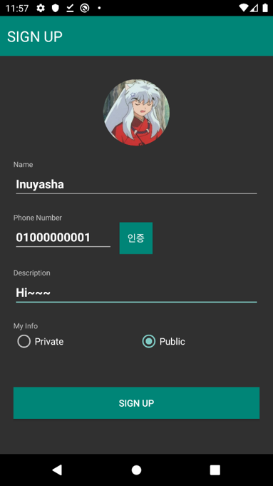
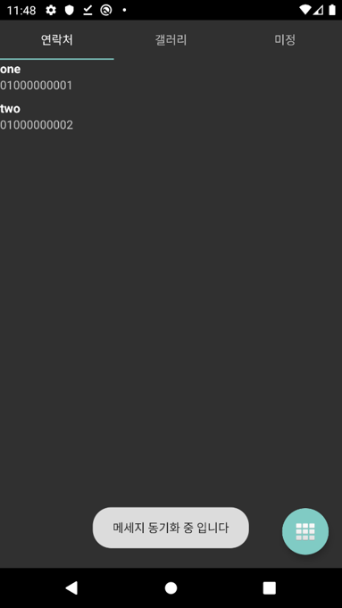
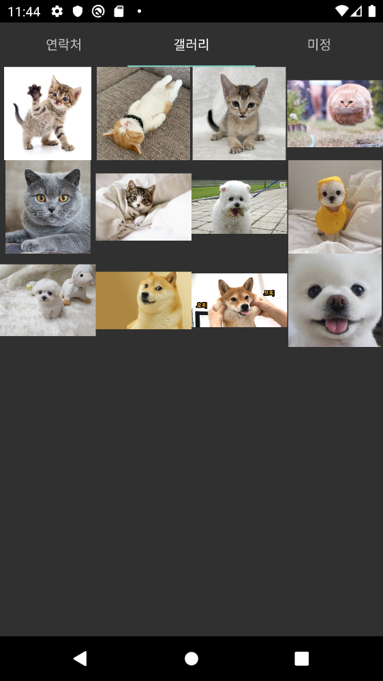
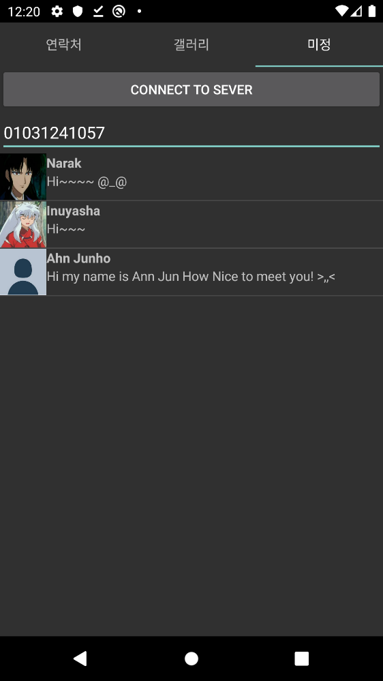

# Bitgaram

Created By: 성희 배
Last Edited: Jan 02, 2020 3:02 PM

# 기술 스택

- Node.js
- Android Studio
- Mongo db
- 개발 기간 : 1주일
- 개발 인원 : 2명 (@forbid403, @ahn9807)

# 전체 앱 구성

# 기능

### 회원 가입

- 회원 가입

    

- 로컬에서 사진 선택 가능
- 회원 가입 후에만 어플리케이션 접근
- 필수 정보 입력 시에만 회원 가입 가능
- SharedPreference로 세션 유지
- 회원가입 시 DB 전송

### TAB1

- 연락처 리스트

    

- 로컬에 있는 연락처 목록을 불러온다.
- 아래 버튼 클릭 시 update

### TAB2

- 갤러리

    

    - 프로젝트 내부의 사진들 불러오기

    

- 사진 클릭 시 확대
- 클릭 한 사진은 opacity 조절로 체크

### TAB3

- 촌수 계산

    

- 핸드폰 번호를 입력 하면, 그 사람이랑 내가 몇 다리 건너야 친구인지 알려주는 기능
- 자료구조 : queue, set
- 알고리즘 : Disjoint-set, BFS
- 친구를 찾으면 경로를 출력, 아니라면 Not found 출력
- 자세한 알고리즘은 [여기](https://www.notion.so/02ab7da983df41e492146bb977967fab)

# 트러블슈팅

- JS는 싱글 스레드 언어여서 서버단에서 데이터를 주고 받을 때 동기화가 필요했다. 데이터를 이미 받았는데도 불구하고 빈 Array를 반환하고는 했다.

    → Async / Await, Promise 등 JS 동기화 문법에 대해서 공부하여 적용하였다. 서버 단에서 데이터를 받아온 이후에 그 데이터 관련 작업을 시행하였다.

- 촌 수 계산 프로그램을 구현 할 때 데이터들의 자료구조, 필요한 알고리즘을 설정하는 데에 어려움을 겪었다.

    → 알고리즘을 설계 할 때 될 것 같은데? 가 아니라, 된다. 의 수준의 확신이 들었을 때에 코드를 짜야 겠다. 이론적으로만 (a.k.a 뇌피셜) 진행하게 되니 구멍이 많아 개발 도중에 멈춰 다시 브레인스토밍을 해야 했다.

# 배운점/느낀점

- 이론으로만 배웠던 알고리즘을 실제로 기능을 구현할 수 있어서 좋았다. 기존 알고리즘을 그대로 가져다 쓰는 게 아니라, 프로젝트에 맞춰 알고리즘을 수정하여 적용할 수 있어서 배울 점이 많았다.
- 디자인 패턴을 적용하려고 했지만 이해도가 낮은 상태에서 프로젝트에 적용하기엔 어려웠다. toy project에서부터 패턴을 적용해보는 공부가 필요한 것 같다.

# 공부한 내용

[https://forbid403.github.io/til/1227-TIL/](https://forbid403.github.io/til/1227-TIL/)

[https://forbid403.github.io/til/1228-TIL/](https://forbid403.github.io/til/1228-TIL/)

[https://forbid403.github.io/til/1229-TIL/](https://forbid403.github.io/til/1229-TIL/)

[https://forbid403.github.io/til/1230-TIL/](https://forbid403.github.io/til/1230-TIL/)

[https://forbid403.github.io/til/1231-TIL/](https://forbid403.github.io/til/1231-TIL/)