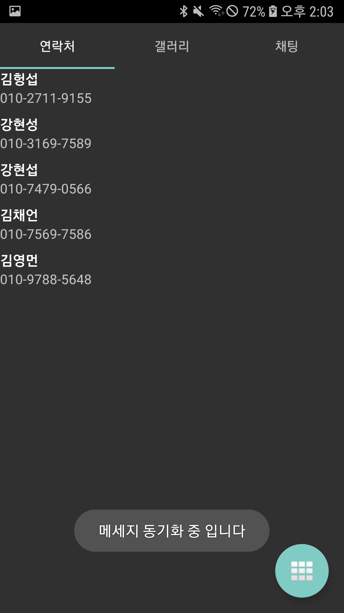
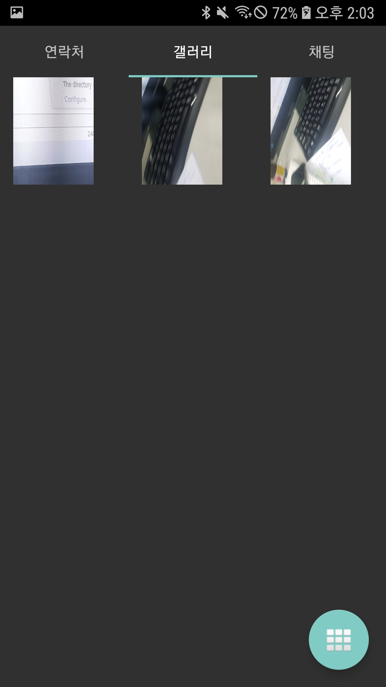
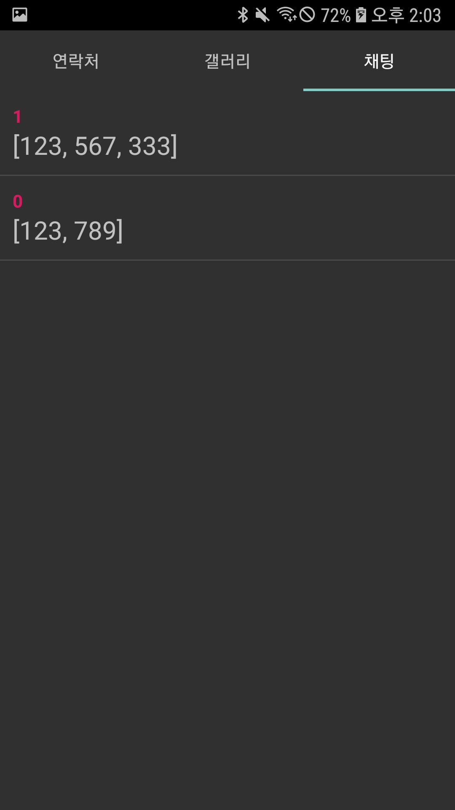
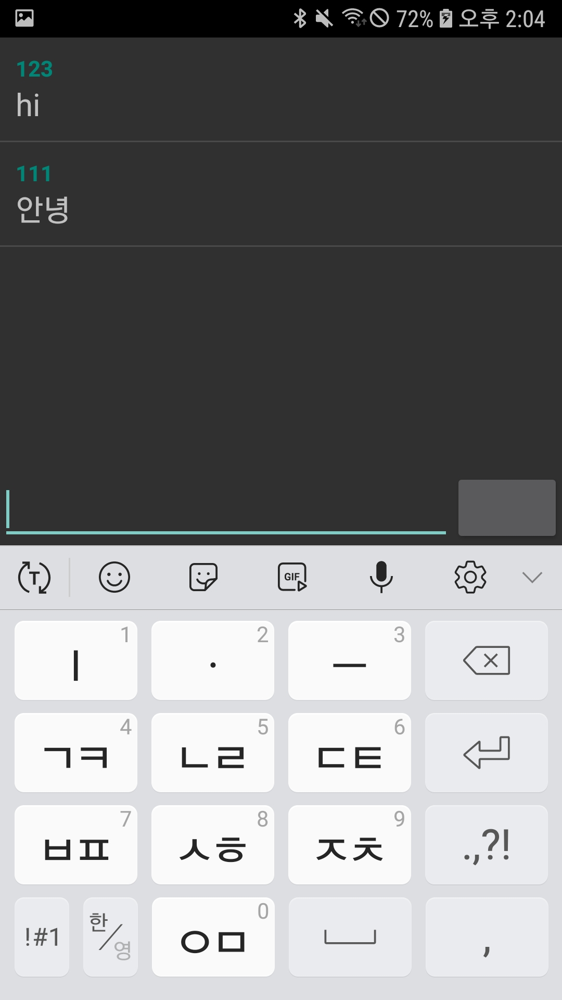

# Bitgaram

Created By: 성희 배
Last Edited: Jan 02, 2020 3:02 PM

# 기술 스택

- Node.js
- Android Studio
- Mongo db
- 개발 기간 : 5일
- 개발 인원 : 2명 (@forbid403, @KangHyunSub)

# 전체 앱 구성

# 기능

### 회원 가입

- 회원 가입

    

- 로컬에서 사진 선택 가능
- 회원 가입 후에만 어플리케이션 접근
- 필수 정보 입력 시에만 회원 가입 가능
- SharedPreference로 세션 유지
- 회원가입 시 회원 정보, 로컬에 있는 갤러리와 연락처를 DB 전송

### TAB1

- 연락처 리스트

    

- DB에 있는 연락처 목록을 불러온다.
- 아래 버튼 클릭 시 update

### TAB2

- 갤러리

    

- DB의 사진들 불러오기
- 사진 클릭 시 확대
- 클릭 한 사진은 opacity 조절로 체크

### TAB3

- 채팅기능
    - 소켓통신을 이용한 채팅 기능
    
    
    - 채팅 방은 DB에 저장된 ID로 구별
    - 채팅 방 입장 시 DB에서 지금까지 대화한 기록들 불러오기
    - socket.join을 사용해 emit시 구별해서 전송

# 트러블슈팅

- emit 시 모든 소켓에게 데이터를 전송하게 되어 다른 채팅방에 있어도 채팅이 업데이트 되는 문제가 생겼다.
    - io.emit이라는 메소드가 현재 소켓 풀에 있는 모든 소켓에게 메세지를 보내기 때문에 발생했다. 검색을 해 보니 join이라는 메서드가 있었다. 소켓을 채팅방 처럼 join으로 방을 만들어, 그 방에 있는 소켓들에게만 메세지를 보낼 수 있었다.
    - 채팅 방을 입장할 시에, 소켓을 연결한다. 서버에 채팅방의 ID를 소켓에 토큰으로 보낸다. 서버에서 io.on으로 connection을 감지 할 때에 소켓에서 보낸 토큰(roomID)로 join을 시킨다.
    - 클라이언트가 채팅 메세지를 보내면 io.to(roomId).emit으로 특정 room 안에만 있는 소켓에게만 메세지를 보낸다!
- AsyncTask의 request가 너무 많아 서버에 부하가 걸려 서버가 다운이 되었다.
    - 

# 배운점/느낀점

- 

# 공부한 내용

[https://forbid403.github.io/til/0102-TIL/](https://forbid403.github.io/til/0102-TIL/)

[https://forbid403.github.io/til/0103-TIL/](https://forbid403.github.io/til/0103-TIL/)

[https://forbid403.github.io/til/0104-TIL/](https://forbid403.github.io/til/0104-TIL/)